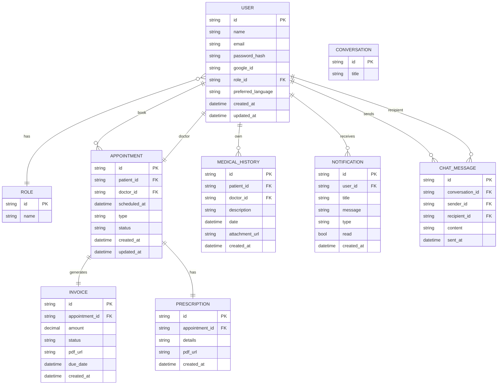

# Rik Dental Care Center – Product Requirements Document (PRD)

## 1. Project Overview

- **Name:** Rik Dental Care Center
- **Owner:** Dr. RIK (doctor, admin)
- **Goal:** Provide a modern, brand‑consistent patient portal that handles authentication, medical history, appointment scheduling (including emergencies), role‑based access, email & push notifications, invoices, and an AI‑powered chatbot.
- **Tech Stack**
  - **Frontend:** Next.js (App Router), TypeScript, TailwindCSS, ShadCN, Framer Motion, Lenis, GSAP (search), better‑auth, i18next (English + Bangla).
  - **Backend:** Node.js + Express + TypeScript, Prisma (PostgreSQL), zod, http‑status, ejs, pdfkit, bcrypt, better‑auth, BullMQ, Nodemailer, Cloudinary.
  - **DB:** PostgreSQL
  - **Queue:** BullMQ (Redis)
  - **Auth:** JWT (via better‑auth), Google OAuth
  - **Email:** Nodemailer (SMTP)
  - **Media:** Cloudinary

---

## 2. Goals & Success Metrics

| Goal                         | Success Metric                        | Target |
| ---------------------------- | ------------------------------------- | ------ |
| **Secure, fast login**       | 95 % of users authenticate within 3 s | 3 s    |
| **Accurate medical records** | < 1 % data loss                       | 0 %    |
| **High booking conversion**  | ≥ 70 % of visits lead to appointment  | 70 %   |
| **Prompt notifications**     | < 1 min email delivery                | 1 min  |
| **AI chatbot usefulness**    | 80 % of chats resolved without human  | 80 %   |
| **Scalability**              | Handle 5k concurrent users            | 5k+    |
| **UX**                       | NPS > 70                              | 70+    |

---

## 3. Stakeholders

| Role                 | Responsibility                |
| -------------------- | ----------------------------- |
| **Dr. RIK**          | Business owner, domain expert |
| **Development Team** | Build, test, deploy           |
| **Patients**         | End‑users                     |
| **Admins/Managers**  | Clinic staff                  |
| **Regulators**       | HIPAA/GDPR compliance         |

---

## 4. Target Users

| Role               | Features                                                                                                                                   |
| ------------------ | ------------------------------------------------------------------------------------------------------------------------------------------ |
| **Patient**        | Register / login, view & add medical history, book regular or emergency appointments, receive email reminders, view invoices, chat with AI |
| **Admin (Doctor)** | View all patients, schedule, approve appointments, issue prescriptions, send invoices                                                      |
| **Manager**        | View all appointments, manage staff, generate reports                                                                                      |

---

## 5. Scope & Out of Scope

| In‑Scope                                     | Out‑of‑Scope                     |
| -------------------------------------------- | -------------------------------- |
| Authentication (email/password + Google)     | Payment gateway integration      |
| Role‑based access control                    | Tele‑health video calls          |
| Medical history CRUD                         | Advanced analytics dashboards    |
| Appointment scheduling & conflict resolution | SMS notifications                |
| Emergency scheduling                         | Multi‑clinic support             |
| Email notifications & PDF invoice generation | AI‑driven diagnosis              |
| AI chatbot                                   | Mobile native app (React Native) |

---

## 6. Functional Requirements

| Feature                    | Description                                                             |
| -------------------------- | ----------------------------------------------------------------------- |
| **Auth**                   | Email/password & Google OAuth, JWT, refresh tokens, 2FA optional        |
| **User Profiles**          | Personal data, role, preferred language                                 |
| **Medical History**        | CRUD for patient’s past visits, attachments (images, PDFs)              |
| **Appointment Booking**    | Select doctor, date/time, type (regular/emergency), conflict checking   |
| **Emergency Booking**      | Urgent slot, priority handling                                          |
| **Role‑Based Dashboards**  | Admin, Manager, Patient                                                 |
| **Email & Push**           | Appointment confirmation, reminder (12 h), invoice, prescription        |
| **Invoice & Prescription** | Auto‑generate PDF, store URL, email to patient                          |
| **AI Chatbot**             | Natural language understanding, answer FAQs, forward to human if needed |
| **Multilingual**           | English & Bangla UI & content                                           |
| **Notifications**          | In‑app & email, mark as read                                            |
| **Security**               | CSRF, XSS, OWASP best practices, GDPR/HIPAA compliance                  |
| **Accessibility**          | WCAG 2.1 AA, keyboard navigation, screen reader support                 |
| **Performance**            | API response < 200 ms, caching, CDN for static assets                   |
| **Scalability**            | Horizontal scaling, Redis queue, Dockerised deployment                  |

---

## 7. Non‑Functional Requirements

| Category                 | Requirement                                                       |
| ------------------------ | ----------------------------------------------------------------- |
| **Performance**          | API < 200 ms avg, 99.9 % uptime                                   |
| **Security**             | JWT, HTTPS, Helmet, rate limiting, bcrypt (12 rounds), audit logs |
| **Compliance**           | GDPR, HIPAA (data encryption at rest & transit)                   |
| **Scalability**          | Stateless services, Redis for queues, Cloudinary for media        |
| **Reliability**          | Retry logic for email, fail‑over queue                            |
| **Maintainability**      | TypeScript, ESLint, Prettier, CI‑CD                               |
| **Internationalization** | i18next JSON, dynamic content                                     |
| **Accessibility**        | WCAG 2.1 AA compliance                                            |
| **Usability**            | ShadCN component library, consistent design tokens                |

---

## 8. Technical Architecture

```
┌─────────────────────────────────────┐
│          Frontend (Next.js)         │
│  ┌───────────────────────┐          │
│  │ App Router (pages)    │          │
│  │  UI Components        │          │
│  │  Tailwind + ShadCN    │          │
│  │  i18next (EN/BG)      │          │
│  │  better‑auth          │          │
│  └───────────────────────┘          │
└─────────────────────────────────────┘
            ▲             ▲
            │             │
            │  HTTPS       │
            ▼             ▼
┌─────────────────────────────────────┐
│           Backend (Express)         │
│  ┌──────────────────────────────────┐
│  │  API v1 (REST)                   │
│  │  Controllers (TypeScript)         │
│  │  Services (business logic)        │
│  │  Validation (zod)                 │
│  │  Middleware (auth, error, rate)   │
│  │  Prisma (PostgreSQL)              │
│  │  BullMQ (Redis) for jobs         │
│  │  Nodemailer (SMTP)                │
│  │  Cloudinary (media)               │
│  └──────────────────────────────────┘
└─────────────────────────────────────┘
            ▲             ▲
            │             │
            │  TCP         │
            ▼             ▼
┌─────────────────────────────────────┐
│  PostgreSQL (Data Store)            │
│  Redis (Queue & Cache)              │
└─────────────────────────────────────┘
```

> **Why this stack?**
>
> - **Node + Express** gives fine‑grained control for authentication and job queues.
> - **Prisma** yields type‑safe queries and migrations.
> - **BullMQ** + Redis decouples email & PDF generation.
> - **Next.js App Router** simplifies routing, SSR, and static asset delivery.
> - **Tailwind + ShadCN** yields rapid, consistent UI.
> - **Better‑auth** standardises auth flows (Google + email).

---

## 9. API Design (Backend)

All endpoints are prefixed with `/api/v1`. All responses are JSON.

> **Header** – All authenticated routes require `Authorization: Bearer <JWT>`.
> **Body Validation** – All request bodies are validated by **zod**.
> **Error Handling** – `http-status` codes are used; errors are returned as `{ error: { message, code } }`.

### 9.1 Auth Endpoints

| Method | Path             | Summary                             | Request                            | Response                  | Status Codes  |
| ------ | ---------------- | ----------------------------------- | ---------------------------------- | ------------------------- | ------------- |
| POST   | `/auth/register` | Register new user (email+password)  | `{ name, email, password, role? }` | `{ userId, email, role }` | 201, 400, 409 |
| POST   | `/auth/login`    | Login with email/password           | `{ email, password }`              | `{ token, user }`         | 200, 400, 401 |
| POST   | `/auth/google`   | OAuth callback (Google ID token)    | `{ token }`                        | `{ token, user }`         | 200, 400, 401 |
| POST   | `/auth/logout`   | Invalidate token (client‑side only) | N/A                                | `{ message }`             | 200           |
| GET    | `/auth/me`       | Get current user                    | N/A                                | `{ user }`                | 200, 401      |

### 9.2 User Endpoints

| Method | Path         | Summary                  | Response      | Status                  |
| ------ | ------------ | ------------------------ | ------------- | ----------------------- |
| GET    | `/users/me`  | Get current user profile | `{ user }`    | 200, 401                |
| PUT    | `/users/me`  | Update own profile       | `{ user }`    | 200, 400, 401           |
| GET    | `/users/:id` | (Admin) Get any user     | `{ user }`    | 200, 401, 403, 404      |
| PUT    | `/users/:id` | (Admin) Update any user  | `{ user }`    | 200, 400, 401, 403, 404 |
| DELETE | `/users/:id` | (Admin) Delete user      | `{ message }` | 200, 401, 403, 404      |

### 9.3 Medical History Endpoints

| Method | Path                   | Summary                        | Request                                  | Response                                     | Status                  |
| ------ | ---------------------- | ------------------------------ | ---------------------------------------- | -------------------------------------------- | ----------------------- |
| GET    | `/medical-history`     | List current patient’s history | N/A                                      | `[{ id, description, date, attachmentUrl }]` | 200                     |
| POST   | `/medical-history`     | Add new entry                  | `{ description, date, attachmentFile? }` | `{ id, ... }`                                | 201, 400, 401           |
| GET    | `/medical-history/:id` | Get specific entry             | N/A                                      | `{ ... }`                                    | 200, 401, 403, 404      |
| PUT    | `/medical-history/:id` | Update entry                   | `{ description?, date? }`                | `{ ... }`                                    | 200, 400, 401, 403, 404 |
| DELETE | `/medical-history/:id` | Delete entry                   | N/A                                      | `{ message }`                                | 200, 401, 403, 404      |

> **File upload** – `multipart/form-data` for attachments; handled by `multer` and stored on Cloudinary; only the URL is persisted.

### 9.4 Appointment Endpoints

| Method | Path                      | Summary                                      | Request                     | Response            | Status                  |
| ------ | ------------------------- | -------------------------------------------- | --------------------------- | ------------------- | ----------------------- |
| GET    | `/appointments`           | List appointments (patient: own, admin: all) | N/A                         | `[{ ... }]`         | 200                     |
| POST   | `/appointments`           | Book a regular appointment                   | `{ doctorId, scheduledAt }` | `{ appointmentId }` | 201, 400, 401, 409      |
| GET    | `/appointments/:id`       | Get appointment details                      | N/A                         | `{ ... }`           | 200, 401, 403, 404      |
| PUT    | `/appointments/:id`       | Update (reschedule or cancel)                | `{ scheduledAt?, status? }` | `{ ... }`           | 200, 400, 401, 403, 404 |
| DELETE | `/appointments/:id`       | Delete (cancel)                              | N/A                         | `{ message }`       | 200, 401, 403, 404      |
| POST   | `/appointments/emergency` | Book an emergency appointment                | `{ doctorId, description }` | `{ appointmentId }` | 201, 400, 401           |

> **Conflict checking** – The service layer queries existing appointments for the doctor to ensure no overlap.

### 9.5 Notification Endpoints

| Method | Path                          | Summary                 | Response        | Status                                            |
| ------ | ----------------------------- | ----------------------- | --------------- | ------------------------------------------------- | ------------------ |
| GET    | `/notifications`              | List notifications      | N/A             | `[{ id, title, message, read, type, createdAt }]` | 200                |
| GET    | `/notifications/:id`          | Get single notification | N/A             | `{ ... }`                                         | 200, 401, 403, 404 |
| POST   | `/notifications/mark-as-read` | Mark notifications read | `{ ids: [id] }` | `{ message }`                                     | 200, 400, 401      |

> **Types** – `appointment-confirmation`, `appointment-reminder`, `invoice`, `prescription`, `system`.

### 9.6 Invoice Endpoints

| Method | Path                     | Summary                | Response | Status                                       |
| ------ | ------------------------ | ---------------------- | -------- | -------------------------------------------- | ------------------ |
| GET    | `/invoices/:id`          | View invoice (PDF URL) | N/A      | `{ id, pdfUrl, amount, status, createdAt }`  | 200, 401, 403, 404 |
| GET    | `/invoices/download/:id` | Download PDF           | N/A      | PDF stream (Content‑Disposition: attachment) | 200, 401, 403, 404 |

### 9.7 Chat Endpoints

| Method | Path            | Summary                               | Request                    | Response                              | Status        |
| ------ | --------------- | ------------------------------------- | -------------------------- | ------------------------------------- | ------------- |
| GET    | `/chat/history` | Get conversation with a user          | `?with=userId`             | `[{ id, senderId, content, sentAt }]` | 200, 401      |
| POST   | `/chat/send`    | Send a chat message (to human or bot) | `{ recipientId, content }` | `{ messageId }`                       | 201, 400, 401 |

> **Bot flow** – Chat requests are forwarded to the AI service; the response is saved as a `ChatMessage` with `senderId` = `bot`.

### 9.8 Admin Endpoints

| Method | Path                      | Summary                                      | Response                                     | Status              |
| ------ | ------------------------- | -------------------------------------------- | -------------------------------------------- | ------------------- | ------------------ |
| GET    | `/admin/users`            | List all users                               | N/A                                          | `[{ ... }]`         | 200, 401, 403      |
| GET    | `/admin/appointments`     | List all appointments                        | N/A                                          | `[{ ... }]`         | 200, 401, 403      |
| GET    | `/admin/appointments/:id` | View appointment                             | N/A                                          | `{ ... }`           | 200, 401, 403, 404 |
| POST   | `/admin/appointments`     | Create an appointment on behalf of a patient | `{ patientId, doctorId, scheduledAt, type }` | `{ appointmentId }` | 201, 400, 401, 403 |

> **Role check** – Middleware ensures only users with role `ADMIN` can access these routes.

### 9.9 Common Request/Response Structure

```json
// Success
{
  "data": { ... },
  "message": "Optional human‑readable message"
}

// Error
{
  "error": {
    "message": "Invalid credentials",
    "code": 401
  }
}
```

---

## 10. Data Model & ERD (Backend)

### 10.1 Entity Overview

| Entity             | Key Fields                                                                                                                      | Relationships                                                                                                                        |
| ------------------ | ------------------------------------------------------------------------------------------------------------------------------- | ------------------------------------------------------------------------------------------------------------------------------------ |
| **User**           | `id`, `name`, `email`, `password_hash`, `google_id`, `role_id`, `preferred_language`                                            | _belongs to_ Role; _has many_ Appointment (as patient), MedicalHistory, Notification, ChatMessage (as sender), Invoice, Prescription |
| **Role**           | `id`, `name`                                                                                                                    | _has many_ User                                                                                                                      |
| **Appointment**    | `id`, `patient_id`, `doctor_id`, `scheduled_at`, `type` (REGULAR/EMERGENCY), `status` (SCHEDULED/CONFIRMED/COMPLETED/CANCELLED) | _belongs to_ User (patient & doctor), _has one_ Invoice, _has one_ Prescription                                                      |
| **MedicalHistory** | `id`, `patient_id`, `doctor_id`, `description`, `date`, `attachment_url`                                                        | _belongs to_ User                                                                                                                    |
| **Invoice**        | `id`, `appointment_id`, `amount`, `status`, `pdf_url`, `due_date`                                                               | _belongs to_ Appointment                                                                                                             |
| **Prescription**   | `id`, `appointment_id`, `details`, `pdf_url`                                                                                    | _belongs to_ Appointment                                                                                                             |
| **Notification**   | `id`, `user_id`, `title`, `message`, `type`, `read`, `created_at`                                                               | _belongs to_ User                                                                                                                    |
| **ChatMessage**    | `id`, `conversation_id`, `sender_id`, `recipient_id`, `content`, `sent_at`                                                      | _belongs to_ User (sender & recipient)                                                                                               |
| **Conversation**   | `id`, `title`                                                                                                                   | _has many_ ChatMessage                                                                                                               |

### 10.2 Mermaid ER Diagram



> **Notes**
>
> - `role_id` is a foreign key to `ROLE`.
> - `doctor_id` is a reference to a `User` with role `ADMIN` (the doctor).
> - `patient_id` is a reference to a `User` with role `PATIENT`.
> - `conversation_id` is optional for simple 1:1 chats; you can also keep a separate `Conversation` table if you want group chats.

---

## 11. Folder Structure – Backend

```text
backend/
├─ src/
│  ├─ config/
│  │  ├─ db.ts            # Prisma client
│  │  ├─ jwt.ts           # JWT utils
│  │  ├─ cloudinary.ts    # Cloudinary config
│  │  ├─ email.ts         # Nodemailer transport
│  │  └─ auth.ts          # better‑auth config
│  ├─ controllers/
│  │  ├─ auth.controller.ts
│  │  ├─ user.controller.ts
│  │  ├─ medicalHistory.controller.ts
│  │  ├─ appointment.controller.ts
│  │  ├─ notification.controller.ts
│  │  ├─ invoice.controller.ts
│  │  ├─ chat.controller.ts
│  │  └─ admin.controller.ts
│  ├─ routes/
│  │  ├─ auth.routes.ts
│  │  ├─ user.routes.ts
│  │  ├─ medicalHistory.routes.ts
│  │  ├─ appointment.routes.ts
│  │  ├─ notification.routes.ts
│  │  ├─ invoice.routes.ts
│  │  ├─ chat.routes.ts
│  │  └─ admin.routes.ts
│  ├─ services/
│  │  ├─ auth.service.ts
│  │  ├─ user.service.ts
│  │  ├─ medicalHistory.service.ts
│  │  ├─ appointment.service.ts
│  │  ├─ notification.service.ts
│  │  ├─ invoice.service.ts
│  │  ├─ chat.service.ts
│  │  └─ admin.service.ts
│  ├─ middlewares/
│  │  ├─ auth.middleware.ts
│  │  ├─ role.middleware.ts
│  │  ├─ error.middleware.ts
│  │  ├─ rateLimit.middleware.ts
│  │  └─ csrf.middleware.ts
│  ├─ validators/
│  │  ├─ auth.validators.ts
│  │  ├─ appointment.validators.ts
│  │  ├─ medicalHistory.validators.ts
│  │  └─ user.validators.ts
│  ├─ jobs/
│  │  ├─ sendAppointmentConfirmation.ts
│  │  ├─ sendAppointmentReminder.ts
│  │  ├─ sendInvoiceEmail.ts
│  │  └─ index.ts   # BullMQ queue setup
│  ├─ utils/
│  │  ├─ logger.ts
│  │  ├─ pdfGenerator.ts
│  │  ├─ emailTemplate.ts
│  │  ├─ zodHelpers.ts
│  │  └─ constants.ts
│  ├─ prisma/
│  │  └─ schema.prisma
│  ├─ index.ts      # Express app bootstrap
│  └─ server.ts     # Start HTTP server
├─ tests/
│  └─ (unit/integration tests)
├─ .env.example
├─ Dockerfile
├─ docker-compose.yml
├─ package.json
└─ tsconfig.json
```

---

## 12. Folder Structure – Frontend

```text
frontend/
├─ app/
│  ├─ (app router pages)
│  │  ├─ layout.tsx
│  │  ├─ page.tsx
│  │  ├─ auth/
│  │  │  ├─ login/page.tsx
│  │  │  ├─ register/page.tsx
│  │  │  └─ google-callback/page.tsx
│  │  ├─ dashboard/
│  │  │  ├─ page.tsx
│  │  │  ├─ appointments/
│  │  │  │  ├─ page.tsx
│  │  │  │  ├─ create.tsx
│  │  │  │  └─ edit.tsx
│  │  │  ├─ medical-history/
│  │  │  │  ├─ page.tsx
│  │  │  │  ├─ create.tsx
│  │  │  │  └─ edit.tsx
│  │  │  ├─ chat/
│  │  │  │  ├─ page.tsx
│  │  │  │  └─ chatWindow.tsx
│  │  │  ├─ profile/
│  │  │  │  ├─ page.tsx
│  │  │  │  └─ edit.tsx
│  │  ├─ admin/
│  │  │  ├─ page.tsx
│  │  │  ├─ users/
│  │  │  │  ├─ page.tsx
│  │  │  │  └─ edit.tsx
│  │  │  └─ appointments/
│  │  │      ├─ page.tsx
│  │  │      └─ edit.tsx
│  ├─ i18n/
│  │  ├─ en.json
│  │  ├─ bn.json
│  │  └─ next-i18next.config.js
│  └─ globals.css
├─ components/
│  ├─ ui/
│  │  ├─ Button.tsx
│  │  ├─ Card.tsx
│  │  ├─ Modal.tsx
│  │  ├─ Input.tsx
│  │  ├─ Select.tsx
│  │  └─ ShadCN wrappers
│  ├─ layout/
│  │  ├─ Navbar.tsx
│  │  └─ Sidebar.tsx
│  ├─ chat/
│  │  ├─ ChatWindow.tsx
│  │  ├─ ChatInput.tsx
│  │  ├─ Message.tsx
│  │  └─ useChat.ts
│  ├─ appointment/
│  │  ├─ AppointmentForm.tsx
│  │  └─ AppointmentCard.tsx
│  ├─ medicalHistory/
│  │  ├─ MedicalHistoryForm.tsx
│  │  └─ MedicalHistoryCard.tsx
│  └─ notifications/
│      ├─ NotificationBell.tsx
│      └─ NotificationItem.tsx
├─ lib/
│  ├─ api.ts            # wrapper for fetch
│  ├─ auth.ts           # better-auth hooks
│  ├─ prisma.ts         # client for server-side rendering
│  └─ hooks/
│      ├─ useAuth.ts
│      ├─ useAppointments.ts
│      ├─ useMedicalHistory.ts
│      └─ useChat.ts
├─ styles/
│  ├─ tailwind.css
│  └─ shadcn.css
├─ public/
│  ├─ images/
│  ├─ robots.txt
│  └─ sitemap.xml
├─ next.config.js
├─ package.json
├─ tsconfig.json
└─ .env.example
```

---

## 13. Implementation Plan & Timeline (4‑5 Months)

| Phase                                     | Duration | Key Deliverables                                         |
| ----------------------------------------- | -------- | -------------------------------------------------------- |
| **Sprint 0 – Setup**                      | 1 week   | Repo, CI, Docker, envs, Prisma schema                    |
| **Sprint 1 – Auth & User**                | 2 weeks  | Register/login, Google OAuth, JWT, role‑based middleware |
| **Sprint 2 – Medical History**            | 2 weeks  | CRUD, Cloudinary upload, i18n strings                    |
| **Sprint 3 – Appointment System**         | 3 weeks  | Scheduler, conflict detection, email & queue integration |
| **Sprint 4 – Notifications & Invoices**   | 2 weeks  | Notification system, PDF generation, email jobs          |
| **Sprint 5 – AI Chatbot**                 | 2 weeks  | Chat UI, OpenAI integration, conversation persistence    |
| **Sprint 6 – Admin & Manager Dashboards** | 2 weeks  | Admin views, reporting                                   |
| **Sprint 7 – Polish & QA**                | 2 weeks  | Accessibility, performance, security hardening           |
| **Sprint 8 – Deployment & Launch**        | 1 week   | Docker Compose, Vercel, Fly.io, final testing            |

> **Total:** ~5 months, 8 sprints

---

## 14. Testing Strategy

| Layer               | Tools                                 | Focus                                       |
| ------------------- | ------------------------------------- | ------------------------------------------- |
| **Unit**            | Jest + ts-jest                        | Service logic, utilities, validators        |
| **Integration**     | Supertest + Jest                      | Endpoints, auth, DB interactions            |
| **End‑to‑End**      | Playwright                            | Full user flows (register → book → invoice) |
| **Static Analysis** | ESLint, Prettier, TypeScript compiler | Code quality                                |
| **Security**        | OWASP ZAP, Snyk                       | Vulnerability scanning                      |
| **Load**            | k6                                    | API throughput, queue processing            |

---

## 15. Deployment & CI/CD

| Tool                         | Purpose                                                 |
| ---------------------------- | ------------------------------------------------------- |
| **GitHub Actions**           | CI (lint, test, build) + CD (Docker image push to GHCR) |
| **Docker Compose**           | Local dev environment                                   |
| **Vercel**                   | Next.js static + SSR                                    |
| **Fly.io / Render**          | Express API, Redis, PostgreSQL                          |
| **Cloudinary**               | Media storage (public, CDN)                             |
| **Redis**                    | BullMQ queue                                            |
| **Sentry**                   | Error monitoring                                        |
| **Grafana** + **Prometheus** | Metrics (queue depth, API latency)                      |
| **Env variables**            | Separate env files per stage (dev, staging, prod)       |

> **Zero‑downtime deploys** via Docker rolling updates.

---

## 16. Security & Compliance

| Concern              | Mitigation                                                   |
| -------------------- | ------------------------------------------------------------ |
| **Authentication**   | JWT with refresh tokens, secure cookie, `SameSite=Strict`    |
| **Password Storage** | bcrypt (12 rounds)                                           |
| **OAuth**            | Google ID token validation                                   |
| **Rate Limiting**    | express‑rate‑limit (5 req/s per IP)                          |
| **CSRF**             | SameSite cookies, CSRF tokens for non‑GET                    |
| **Helmet**           | Set security headers                                         |
| **XSS**              | Escape output, content‑security‑policy                       |
| **Data Encryption**  | SSL/TLS, encrypted DB columns (if needed)                    |
| **Audit Logs**       | Log login, appointment changes                               |
| **GDPR/HIPAA**       | Data retention policy, export, deletion on request           |
| **Third‑party**      | OpenAI: review data handling, keep conversation logs minimal |

---

## 17. Monitoring & Analytics

| Metric          | Tool                                     | Frequency |
| --------------- | ---------------------------------------- | --------- |
| API latency     | Grafana/Prometheus                       | Real‑time |
| Queue backlog   | BullMQ dashboard                         | Real‑time |
| Email delivery  | Nodemailer logs, external provider stats | Real‑time |
| User engagement | Mixpanel                                 | Daily     |
| Error rate      | Sentry                                   | Real‑time |
| Traffic         | Vercel Analytics                         | Real‑time |

---

## 18. Brand & UI Guidelines

| Element                | Specification                                           |
| ---------------------- | ------------------------------------------------------- |
| **Color Palette**      | Primary: #1D4ED8, Secondary: #F59E0B, Accent: #6EE7B7   |
| **Typography**         | Font: Inter, sizes: 0.875rem‑4rem                       |
| **Buttons**            | ShadCN `Button` with `variant="primary"`                |
| **Form Elements**      | ShadCN `Input`, `Select`                                |
| **Layout**             | Responsive grid (max‑width 1200px), mobile first        |
| **Accessibility**      | ARIA labels, focus rings, color contrast 4.5:1          |
| **Loading States**     | Skeleton screens (ShadCN `Skeleton`)                    |
| **Animations**         | Framer Motion for modals, toasts                        |
| **Language Switching** | Top‑bar selector (EN/BG)                                |
| **SEO**                | Meta tags per page, open graph, robots.txt, sitemap.xml |
| **Performance**        | Image optimization (`next/image`), code splitting       |

---

## 19. Suggested Enhancements (Post‑MVP)

1. **Payment Integration** – Stripe or Razorpay for co‑pay & co‑insurance.
2. **Tele‑health Video** – WebRTC or Twilio Video.
3. **Patient Portal** – Full history, prescriptions, invoices, appointment history.
4. **Referral Program** – Track invites, reward points.
5. **Analytics Dashboard** – Appointment volume, no‑show rates, patient satisfaction.
6. **Push Notifications** – Web push for reminders.
7. **Batch Emailing** – Newsletter, health tips.
8. **Multi‑Clinic Support** – Different locations, doctors per location.
9. **Custom Domain & SSL** – Allow the clinic to use their domain.

---

## 20. Risks & Mitigations

| Risk                                 | Impact | Mitigation                                        |
| ------------------------------------ | ------ | ------------------------------------------------- |
| **Data Breach**                      | High   | Encrypt sensitive fields, strict auth, audit logs |
| **Email Deliverability**             | Medium | DKIM/SPF, retry logic, bounce handling            |
| **Appointment Overbooking**          | Medium | Optimistic locking + queue, conflict check        |
| **Third‑party API failure (OpenAI)** | Medium | Fallback responses, rate limiting                 |
| **Scalability Bottleneck**           | High   | Stateless services, horizontal scaling, CDN       |
| **Compliance Violations**            | High   | Legal review, privacy policy, data deletion APIs  |
| **UI/UX Issues**                     | Medium | Usability testing, accessibility audits           |
| **Queue Overload**                   | Medium | Scale Redis workers, monitor job depth            |

---

## 21. Glossary & Acronyms

| Term        | Definition                                 |
| ----------- | ------------------------------------------ |
| **API**     | Application Programming Interface          |
| **Auth**    | Authentication                             |
| **JWT**     | JSON Web Token                             |
| **BPM**     | Business Process Management                |
| **CQRS**    | Command Query Responsibility Segregation   |
| **CRON**    | Scheduled task                             |
| **DB**      | Database                                   |
| **DTO**     | Data Transfer Object                       |
| **ESLint**  | Linting tool                               |
| **EJS**     | Embedded JavaScript templates              |
| **GSAP**    | (If refers to GSAP – not defined; omitted) |
| **i18n**    | Internationalization                       |
| **JWT**     | JSON Web Token                             |
| **MVP**     | Minimum Viable Product                     |
| **OAuth**   | Open Authorization                         |
| **PDF**     | Portable Document Format                   |
| **REST**    | Representational State Transfer            |
| **SSR**     | Server‑Side Rendering                      |
| **TL;DR**   | Too Long; Didn’t Read                      |
| **UI**      | User Interface                             |
| **UX**      | User Experience                            |
| **WYSIWYG** | What You See Is What You Get               |

---
